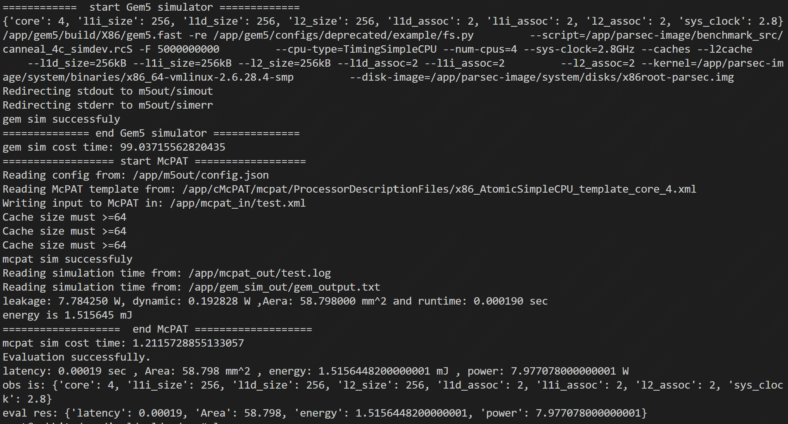

# A multi-core processor design space exploration algorithm based on in-context RL

## Intro
The parsec-tests2 and m5out folders are used to put the sum of gem5&mcpat evaluation functions.

Since some of the previous reinforcement learning methods for processor design space exploration are one-time, that is, each time the constraint parameters are set, and then start training a new model suitable for the current scene, whenever the design requirements under the new scene (new constraints) are needed, the design needs to be re-designed from scratch, so the time cost is very high, this project is committed to applying In-Context RL to DSE, so as to realize the new constraint parameters that can modify the design framework and quickly apply it to the new scene.

## Quick Start

### 1. Prepare for simulation envirmoent
```bash
docker pull lucifercn22/dse-cpu:v2.0.0
docker run -it --net=host --name=dse lucifercn22/dse-cpu:v2.0.0 bash
```
### 2. Prepare python envirmoent
```bash
git clone https://github.com/xue-yun-liang/icrl.git
conda create -n icrl python==3.8
conda activate icrl
cd icrl & pip install requirement.txt
```
### 3. Install environment
The environment part of the repository itself is separated, and the installation of the environment needs to refer to [this repository](https://github.com/xue-yun-liang/dse_env)
Then, if you see the picture below, it indicates that the environment for evaluating the function is not a problem and you can start other development.

